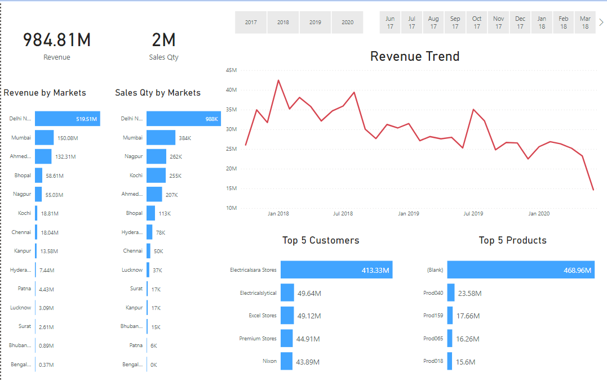
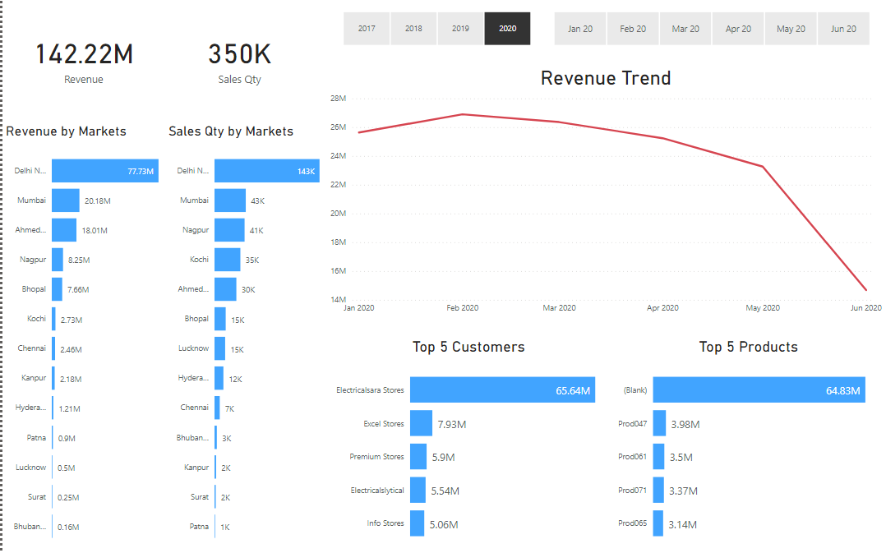
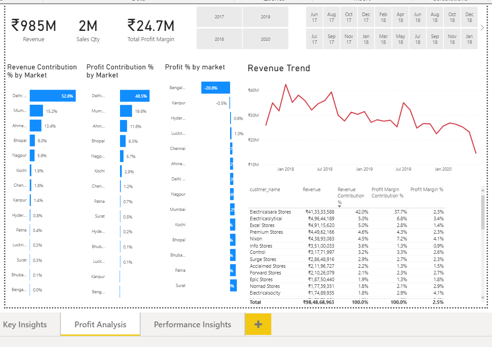
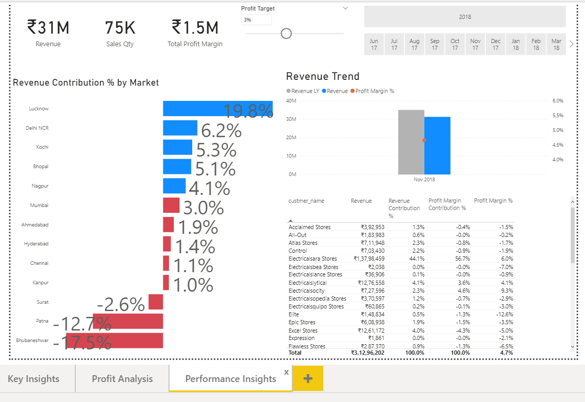

# Sales-Insight-using-Power-BI
In this project we have created a Dashboard which is used to visualize overall performance of company like Total Revenue, Total Sales Quantity, Top 5 Customer etc

By using Power-BI tool we can create dynamic dashboard which will show performance based of various parameter like on years, Top 5 Products etc.

This is the first page of report where we can visualize Total Revenue, Total Sales, Performance of the company

This page is for Profit Analysis and Revenue Trend

Performance Insights

